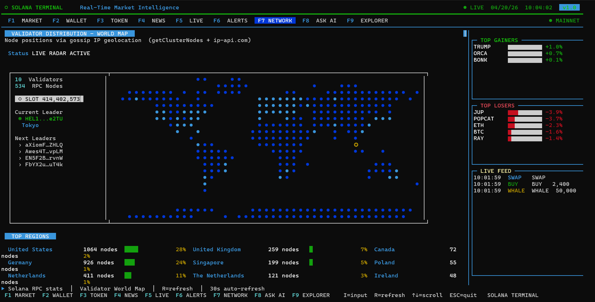
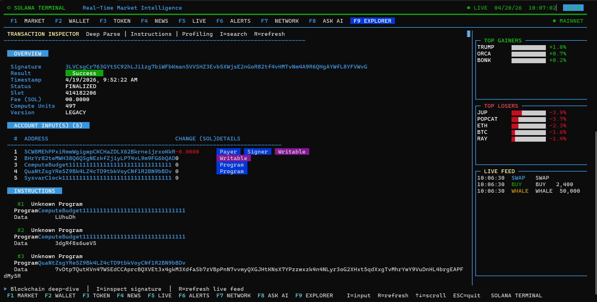

# ⬡ Solana TUI Explorer

> **A Developer-Centric, Keyboard-Driven CLI Explorer for Solana.**  
> *Never leave your terminal to open Solscan or debug an Anchor program error again.*

---

## 🔍 The Problem

Solana developers spend most of their time in the terminal, yet navigating chain diagnostics today is highly fragmented and painful:

1. **Official Solana CLI**: Primarily designed for executing transactions or pulling raw, unformatted JSON blobs. It treats Anchor smart contracts as opaque byte blobs and returns raw hex codes on transaction failures with no debugging context.
2. **Web Explorers (Solscan/SolanaFM)**: Extremely rich but force a developer to constantly break context, switch tabs, or copy-paste transaction signatures to a browser.
3. **Mucho CLI**: Functions primarily as a local testnet fixture cloner. Its inspection utilities are highly limited, outputting static text for basic txs with zero live monitoring or simulation capability.

---

## ⚡ The Solution

**Solana TUI Explorer** acts as a real-time, low-latency command center that brings advanced explorer details, account deserialization, and local validator monitoring directly to the terminal workspace. It runs instantly via `npx` with zero setup.

<div align="center">
  
  
  <br>
  <em>Live Network Gossip Radar Map & Deep Transaction Profiler inside the Terminal.</em>
</div>

---

## 🛠️ Core Features & Capabilities

The TUI Explorer is built on six core pillars, accessible via keys **F1 through F6**:

### 1. F1: Network Gossip & Local Validator Health
* **Live Radar Map**: Geographically tracks validator nodes via gossip IP geolocation using a custom mapped ASCII world radar.
* **Epoch Progress Tracker**: Displays real-time epoch slot increments, percentages, and estimated time remaining in the current epoch.
* **TPS & Blocktime Charts**: Solid-filled, real-time TUI charts mapping block speeds and network transaction throughput.
* **Localhost Dev Validator Monitoring**: Fully integrates with your local `solana-test-validator`. Intercepts slot updates, program deployments, transaction executions, and state modifications happening on your local machine, allowing developers to see their localhost program interactions clearly and instantly in the TUI without parsing through raw console log outputs.
* **Validator Leaderboard**: Lists the top 10 validators by active stake, delegator count, and commission rates.

### 2. F2: Account & Program Inspector
* **Type Auto-Detection**: Paste any public key. The inspector automatically queries `getAccountInfo` and identifies whether it is an SPL Token Account, Mint Account, System Account, Stake Account, PDA, or Program.
* **State Deserialization**: Deserializes raw account buffer data into readable keys and variables (owner, delegated amount, supply, decimals, authorities) instead of opaque hex blobs.
* **Anchor IDL Parser**: Fetch on-chain program IDLs or load local IDL JSON files to inspect program methods, parameter schemas, and expected account bounds.

### 3. F3: SPL Token Explorer
* **Token Parameters**: Deep audit of SPL Token specifications, mint authority state, and freeze authority settings.
* **Token-2022 Extensions**: Explores new token program extensions (metadata pointers, transfer fees, interest rates) natively.
* **RugCheck Integration**: Performs a security audit via RugCheck APIs, reporting rug scores, LP locking status, and warning markers.

### 4. F4: AI Debugger Assistant
* **Solana Context Engine**: Powered by Groq Llama 3.3-70b-versatile, acting as an on-chain systems assistant.
* **Error Decoder**: Feed in obscure hex errors (e.g., custom program error `0x1771`) and get instant translations (e.g., Anchor `ConstraintHasOne` violation) and Rust remediation scripts.

### 5. F5: Transaction Explorer, Simulator & Live Indexer
* **Instruction Stack Trace**: Maps out the exact call sequence (including inner CPI calls) of any finalized transaction signature.
* **Balance Delta Auditor**: Displays a table of all inputs and outputs showing which signers, write-locks, and payers had their SOL or token balances changed.
* **Compute Unit (CU) Profiler**: Displays a stacked, multi-colored bar chart showing exactly which instructions consumed the most compute budget.
* **Tx Simulator (Dry Run)**: Run pre-flight simulations to profile compute units and audit account balances before submitting transactions on-chain.
* **Live Program Indexer**: Subscribe to any program ID via RPC WebSockets to capture and stream decoded logs, instructions, and events in real time.

### 6. F6: LiteSVM Local Testing
* **Split Panel Inspector**: Left pane lists test transactions (Success/Failure status and signature); right pane displays detailed instruction log stack traces, timestamps, and compute unit footprints.
* **Real-time Session Watcher**: Listens to local log file updates to automatically parse and refresh the TUI display as `cargo test` executes.
* **Post-Execution State Retention**: Keeps critical transaction details visible on screen even after the test suite finishes running and the memory-bound LiteSVM instance shuts down.

---

## 📐 System Architecture & Design Document (Build Process)

Solana TUI Explorer is structured as a modular terminal dashboard. Below is the system flow and design layout of the TUI Explorer:

```
┌────────────────────────────────────────────────────────┐
│                  Solana TUI Explorer                   │
│                                                        │
│   ┌────────────────────────────────────────────────┐   │
│   │             Blessed Dashboard Layout           │   │
│   │   (F1: Network │ F2: Account │ F3: Token...)   │   │
│   └──────┬──────────────────────────────────┬──────┘   │
└──────────┼──────────────────────────────────┼──────────┘
           │ WebSocket & RPC                  │ File Watches & Sockets
           ▼                                  ▼
┌──────────────────────┐            ┌────────────────────┐
│      Solana RPC      │            │  LiteSVM Testbed / │
│   (Mainnet/Devnet)   │            │   Local Validator  │
└──────────┬───────────┘            └─────────┬──────────┘
           ▼                                  ▼
┌──────────────────────┐            ┌────────────────────┐
│   On-Chain IDLs &    │            │   Local Session    │
│  Account Deser.      │            │   Transaction Logs │
└──────────────────────┘            └────────────────────┘
```

### 1. Modular Core Components
* **Blessed Terminal UI Layout**: Utilizes Node.js `blessed` and `blessed-contrib` libraries to build a responsive, grid-based dashboard layout. Keyboard keypress handlers drive fast context switches between tabs (Network, Accounts, Tokens, LiteSVM/Localhost, and Explorer views).
* **RPC & Telemetry Streamers**: Maintains WebSocket connection streams (`@solana/web3.js`) to capture new slot announcements, transaction activities, and network health stats, rendering them dynamically inside scrolling charts and log panels.
* **Local Testbed Monitor Daemon**: Watches designated local workspace log files generated by `LiteSVM` or intercepts port `8899` localhost RPC events to display state mutations from test executions in real time.
* **IDL Serialization Engine**: Queries and caches Anchor IDL schemas to dynamically deserialize instruction data and account structures inside the UI panels.

### 2. Technology Stack
* **Languages**: JavaScript/Node.js.
* **TUI Frameworks**: `blessed` and `blessed-contrib` for mouse/keyboard inputs and component layout.
* **Solana Interface**: `@solana/web3.js` for RPC and socket calls.
* **Deployment & Infrastructure**: Backend services deployed on AWS EC2 instances, utilizing Redis for caching hot account variables and processed IDLs to optimize RPC limits and maintain high TUI performance.
* **Build/Packaging**: Node standard package manager (`npm`), compiled down to a standard global CLI package binary run via `npx`.

---

## 🚀 Getting Started

Launch the developer TUI instantly using Node:

```bash
npx solana-tui-explorer
```

### Manual Installation (For Development/Contribution)

If you would like to run the explorer locally or add deserializers:

```bash
# Clone the repository
git clone https://github.com/akshaydhayal/Solana-TUI-Explorer.git
cd Solana-TUI-Explorer/cli

# Install dependencies
npm install

# Run the CLI
node bin/st.js
```

---

## ⚙️ Navigation & Shortcuts

* `F1` - `F6` : Switch panels.
* `I` : Open the input modal (enter transaction signatures, token mints, wallet addresses, or ask the AI debugger).
* `R` : Force-refresh the active tab's RPC or session state.
* `T` : Toggle token chart timeframes (`5M`, `1H`, `1D`).
* `C` : Toggle connection network (Mainnet-Beta, Devnet, Testnet, Localhost).
* `↑ / ↓` or `J / K` : Scroll vertically through list menus or text areas.
* `ESC / Q` : Quit the application.

---

## 🧪 LiteSVM Local Testing Integration Guide

To track in-memory LiteSVM transaction executions directly in your TUI Explorer:

1. Copy the wrapper helper [litesvm_explorer.rs](file:///c:/Users/TIS/Documents/Akshay/Solana-TUI-Explorer/litesvm-integration/litesvm_explorer.rs) into your Rust project (e.g. `tests/litesvm_explorer.rs`).
2. Add `serde` and `serde_json` to your project dependencies in `Cargo.toml`.
3. In your integration tests, import the module and use the wrapper `ExplorerLiteSVM` instead of `LiteSVM`:
   ```rust
   // Import the module
   mod litesvm_explorer;
   use litesvm_explorer::ExplorerLiteSVM;

   #[test]
   fn test_my_program() {
       // ExplorerLiteSVM wraps LiteSVM and auto-clears log files on boot
       let mut svm = ExplorerLiteSVM::new();

       // Execute transaction tests as usual
       let res = svm.send_transaction(tx);
       assert!(res.is_ok());
   }
   ```
4. Start your TUI explorer in the program project directory, switch to the **F6 LITESVM** tab, and run your tests using:
   ```bash
   cargo test
   ```
   The TUI will instantly capture and display transaction stack traces, compute footprint graphs, and diagnostic execution logs!


